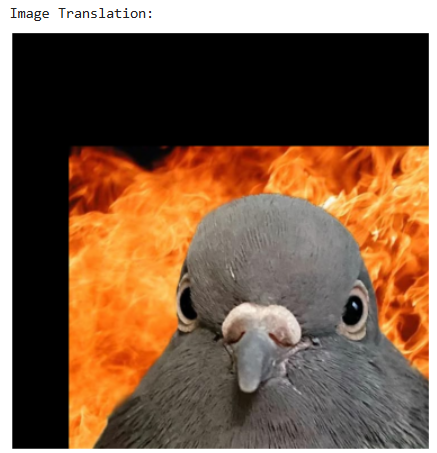
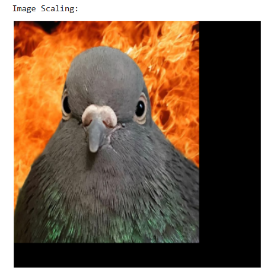
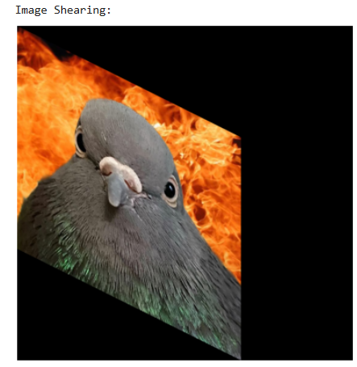
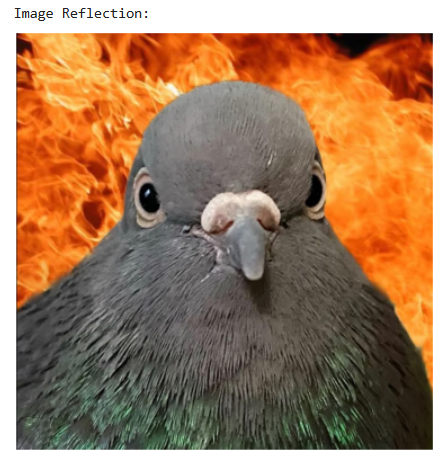
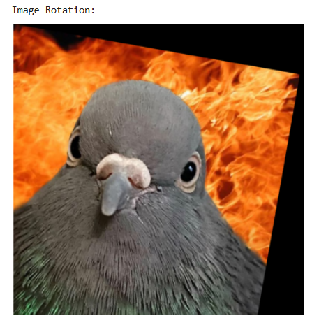
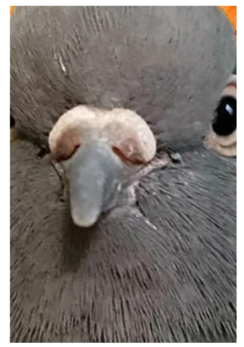

# IMAGE-TRANSFORMATIONS


## Aim
To perform image transformation such as Translation, Scaling, Shearing, Reflection, Rotation and Cropping using OpenCV and Python.

## Software Required:
Anaconda - Python 3.7

## Algorithm:
### Step1: 
Import the required packages.
<br>

### Step2:
Load the image file in the program.
<br>

### Step3:
Use the techniques for Translation, Scaling, Shearing, Reflection, Rotation and Cropping using OpenCV and Python.
<br>

### Step4:
Display the modified image output
<br>

### Step5:
End the program.
<br>

## Program:

### Developed By: Nandakesore J
### Register Number: 212223240103
## i)Image Translation
```
import cv2
import numpy as np
import matplotlib.pyplot as plt
input_image=cv2.imread("fire_pigeon.jpg")
input_image=cv2.cvtColor(input_image,cv2.COLOR_BGR2RGB)
plt.axis('off')
print("Input Image:")
plt.imshow(input_image)
plt.show()
rows,cols,dim=input_image.shape
M=np.float32([[1,0,100],[0,1,200],[0,0,1]])
translated_image=cv2.warpPerspective(input_image,M,(cols,rows))
plt.axis('off')
print("Image Translation:")
plt.imshow(translated_image)
plt.show()
```


## ii) Image Scaling
```
import cv2
import numpy as np
import matplotlib.pyplot as plt
input_image=cv2.imread('fire_pigeon.jpg')
input_image=cv2.cvtColor(input_image,cv2.COLOR_BGR2RGB)
plt.axis('off')
print("Input Image:")
plt.imshow(input_image)
plt.show()
rows,cols,dim=input_image.shape
M=np.float32([[1.5,0,0],[0,1.8,0],[0,0,1]])
translated_image=cv2.warpPerspective(input_image,M,(cols*2,rows*2))
plt.axis('off')
print("Image Scaling:")
plt.imshow(translated_image)
plt.show()
```

## iii)Image shearing
```
import cv2
import numpy as np
import matplotlib.pyplot as plt
input_image=cv2.imread('fire_pigeon.jpg')
input_image=cv2.cvtColor(input_image,cv2.COLOR_BGR2RGB)
plt.axis('off')
print("Input Image:")
plt.imshow(input_image)
plt.show()
rows,cols,dim=input_image.shape
M1=np.float32([[1,0.5,0],[0,1,0],[0,0,1]])
M2=np.float32([[1,0,0],[0.5,1,0],[0,0,1]])
translated_image1=cv2.warpPerspective(input_image,M1,(int(cols*1.5),int(rows*1.5)))
translated_image2=cv2.warpPerspective(input_image,M2,(int(cols*1.5),int(rows*1.5)))
plt.axis('off')
print("Image Shearing:")
plt.imshow(translated_image1)
plt.imshow(translated_image2)
plt.show()
```

## iv)Image Reflection
```
import cv2
import numpy as np
import matplotlib.pyplot as plt
input_image=cv2.imread('fire_pigeon.jpg')
input_image=cv2.cvtColor(input_image,cv2.COLOR_BGR2RGB)
plt.axis('off')
print("Input Image:")
plt.imshow(input_image)
plt.show()
rows,cols,dim=input_image.shape
M1=np.float32([[1,0,0],[0,-1,rows],[0,0,1]])
M2=np.float32([[-1,0,cols],[0,1,0],[0,0,1]])
translated_image1=cv2.warpPerspective(input_image,M1,(int(cols),int(rows)))
translated_image2=cv2.warpPerspective(input_image,M2,(int(cols),int(rows)))
plt.axis('off')
print("Image Reflection:")
plt.imshow(translated_image1)
plt.imshow(translated_image2)
plt.show()
```

## v)Image Rotation
```
import cv2
import numpy as np
import matplotlib.pyplot as plt
input_image=cv2.imread('fire_pigeon.jpg')
input_image=cv2.cvtColor(input_image,cv2.COLOR_BGR2RGB)
plt.axis('off')
print("Input Image:")
plt.imshow(input_image)
plt.show()
rows,cols,dim=input_image.shape
angle=np.radians(10)
M=np.float32([[np.cos(angle),-(np.sin(angle)),0],[np.sin(angle),np.cos(angle),0],[0,0,1]])
translated_image=cv2.warpPerspective(input_image,M,(int(cols),int(rows)))
plt.axis('off')
print("Image Rotation:")
plt.imshow(translated_image)
plt.show()
```

### vi)Image Cropping
```
import cv2
import matplotlib.pyplot as plt
image = cv2.imread("fire_pigeon.jpg")
h, w, _ = image.shape
cropped_face = image[int(h*0.2):int(h*0.8), int(w*0.3):int(w*0.7)]
cv2.imwrite("cropped_pigeon_face.jpg", cropped_face)
plt.imshow(cv2.cvtColor(cropped_face, cv2.COLOR_BGR2RGB))
plt.axis("off")
plt.show()

```


## Output:
### i)Image Translation




### ii) Image Scaling




### iii)Image shearing




### iv)Image Reflection




### v)Image Rotation



### vi)Image Cropping




## Result: 

Thus the different image transformations such as Translation, Scaling, Shearing, Reflection, Rotation and Cropping are done using OpenCV and python programming.
